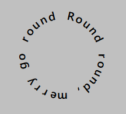

# \<circlular-text></circlular-text>
A small web component for displaying text in a circle.

# Getting Started
This is basically a div that turns its slotted text (and only text) in display it in a circle.

You can simply import the JS, and use it in the markup.
  ```html
  <script src="/dist/browser/circular-text.js"></script>
  <circlular-text>Round round, merry go round</circlular-text>
  ```



# CSS Custom properties
### **--spacing**: number
The space between each letters. Basically like `letter-spacing`.
### **--offset**: number
The offset of the start of the first letter. Basically like `rotate`.